# Jar文件手动处理记录
对于以下两种情况，我们需要手动编辑jar文件中的数据或代码。

本文件用于追踪当前版本jar文件的手动处理记录。

1. 需要翻译的string对应的UTF-8常量同时被其它代码元素引用，无法直接替换。
2. 游戏本身的代码逻辑需要修改，以适应翻译后的文本。

## UTF-8常量被string以外的元素引用
| 文件路径 | 原文 |
|---|---|
| starfarer_obf.jar: com/fs/starfarer/campaign/CharacterStats.class | `points` |
| starfarer_obf.jar: com/fs/starfarer/coreui/x.class | `max` |
| starfarer_obf.jar: com/fs/starfarer/launcher/opengl/GLLauncher.class | `fullscreen` |
| starfarer_obf.jar: com/fs/starfarer/launcher/opengl/GLLauncher.class | `sound` |
| starfarer_obf.jar: com/fs/starfarer/ui/newui/X.class | `next` |
| starfarer.api.jar: com/fs/starfarer/api/impl/campaign/intel/group/FleetGroupIntel.class | `fleets` |

## 代码逻辑修改

### 1. 存档页面存档难度文本
相关文件：`starfarer_obf.jar:com/fs/starfarer/campaign/save/LoadGameDialog$o.class`
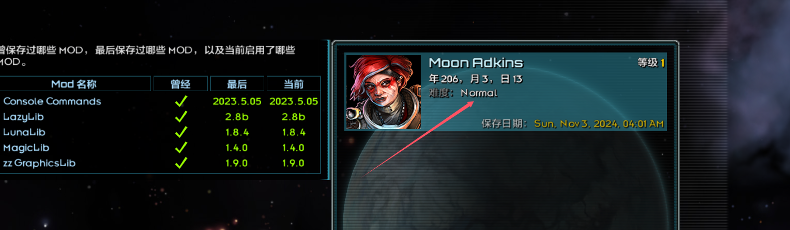

这里的 `Normal` 是直接读取了 SaveGameData 的 difficulty 属性，可能的值为 `normal` 和 `easy`，并令其开头大写。
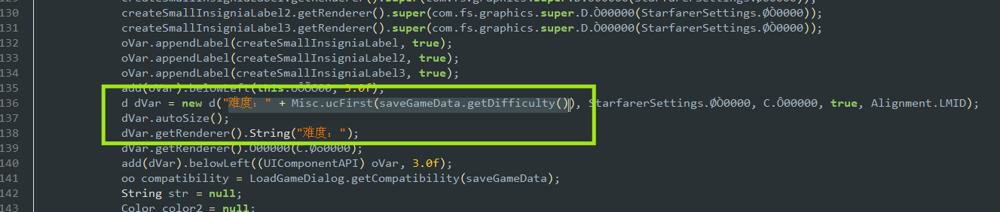
两个常量在 `starfarer.api.jar:com/fs/starfarer/api/impl/campaign/ids/Difficulties.class` 中定义
而该属性同时用作难度的id，所以不便直接翻译常量的值。需要添加处理逻辑来把难度id映射到中文难度。

### 2. GenerateSlipsurgeAbility.getStrengthForStellarObject() 实现bug
相关文件：`starfarer.api.jar:com/fs/starfarer/api/impl/campaign/abilities/GenerateSlipsurgeAbility.class`
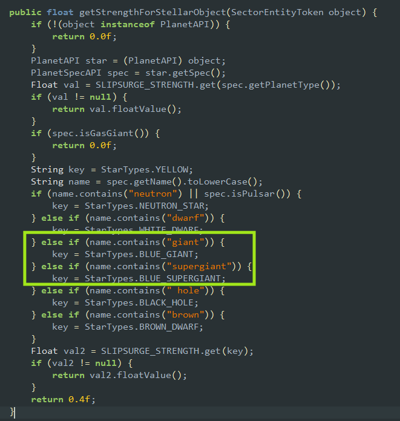
1. 先判断 .contains('giant') 会覆盖后续的 .contains('supergiant') 条件
2. 建议不要使用名字来判断恒星类型

### 3. 蓝图浏览器页面船体规模文本
相关文件：`starfarer_obf.jar:com/fs/starfarer/campaign/command/N.class`
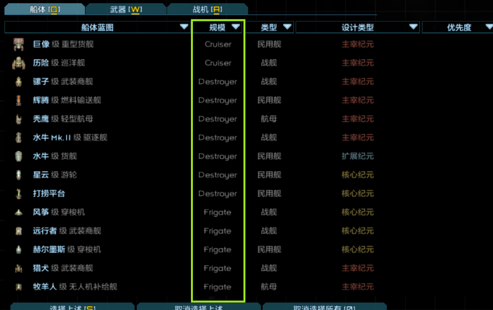

这里读取了舰船的 getHullSize().name().toLowerCase() 作为船体规模文本，
且 HullSize 枚举未指定 displayName，所以无法直接翻译。
注意到下方针对主力舰单独写了一个if，也许可以暂时为其它船体规模页加几个if来显示。
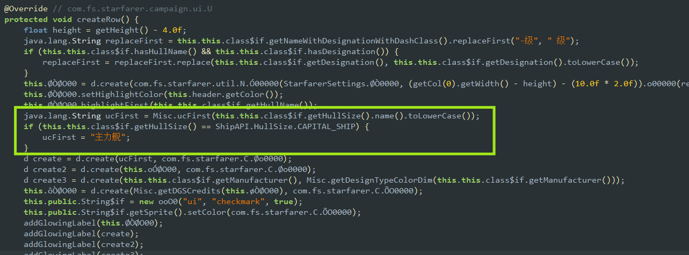

### 4. 战斗UI武器伤害类型文本
相关文件：`starfarer_obf.jar:com/fs/starfarer/renderers/oOOO/C$o.class`
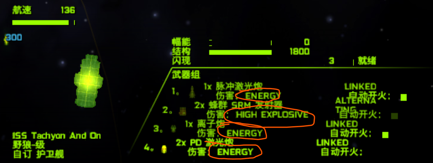

这里使用了 DamageType 枚举的 .toString() 方法，但是其实应当使用 .getDisplayName()，导致无法翻译
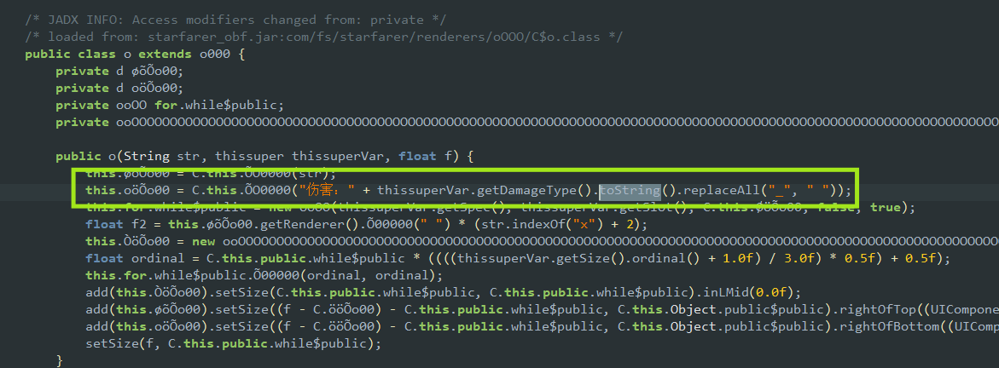

### 5. 战斗UI武器组类型文本
相关文件：`starfarer_obf.jar:com/fs/starfarer/renderers/oOOO/C.class`
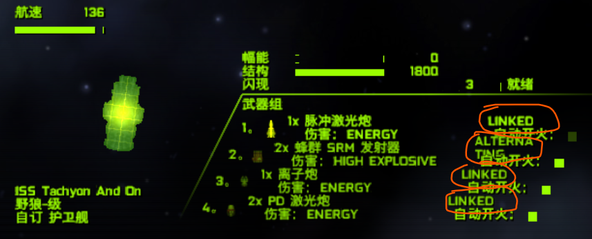

这里使用了 WeaponGroupType 枚举的 .toString() 方法，但是其实应当使用 .getDisplayName()，导致无法翻译
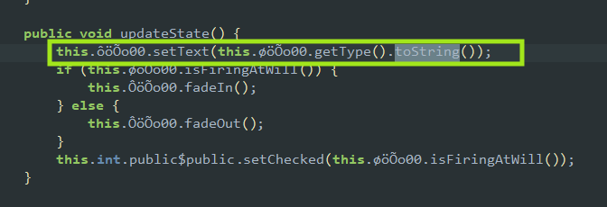

### 6. 舰船信息页文本换行前缺少最后一个字
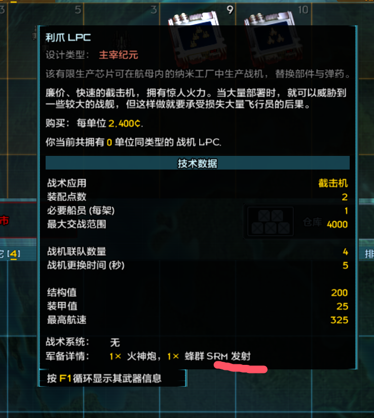
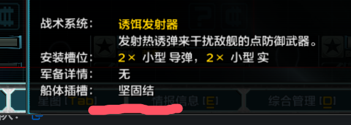

渡鸦：
> 末尾掉字的问题我有头绪了，猜测是Alex偷懒。在列表一大串武器和设备的时候，
> Alex估计是直接无脑都在string后加了“, ”(英文逗号和空格)之后，在把末尾两个字符削掉。
> 然后这次汉化我们统一了中文标点，原来的俩字符变成了中文逗号单字符，
> 于是末尾就被多吃了一个字符

### 7. 敌对活动事件名称为英文 'Hostilities'
相关文件：`starfarer.api.jar:com/fs/starfarer/api/impl/campaign/intel/FactionHostilityIntel.class`

> 尝试直接翻译文件内的tag

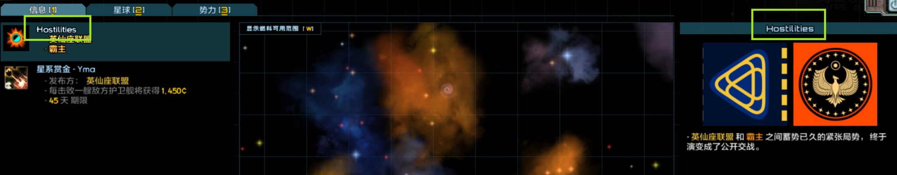

代码中这里直接用了事件tag `Tags.INTEL_HOSTILITIES`，无法直接翻译。
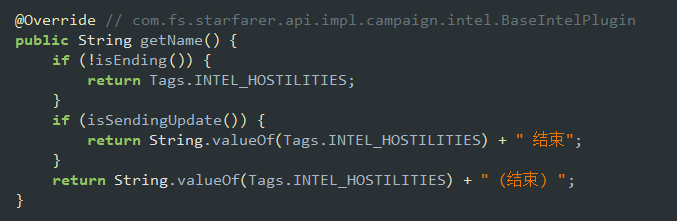

考虑修改为直接返回字符串 "敌对活动"

### 8. 战斗页面舰船部署提示字体不显示
相关文件：`starfarer_obf.jar:com/fs/starfarer/E/B/OOoOOOOOOOOO....class`

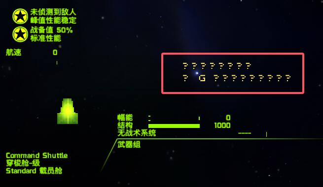

修改字体为标准字体，字体大小从21调整为14

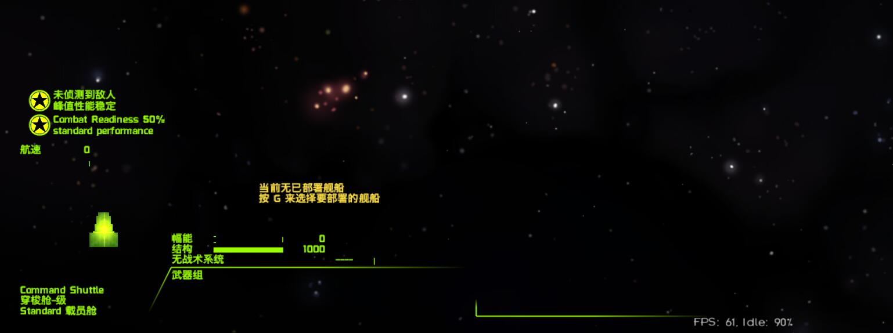