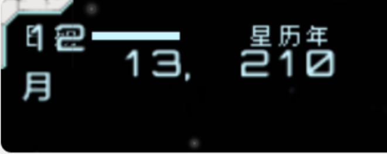

# Jar文件手动处理记录
对于以下两种情况，我们需要手动编辑jar文件中的数据或代码。

本文件用于追踪当前版本jar文件的手动处理记录。

1. 需要翻译的string对应的UTF-8常量同时被其它代码元素引用，无法直接替换。
2. 游戏本身的代码逻辑需要修改，以适应翻译后的文本。

## UTF-8常量被string以外的元素引用
| 文件路径 | 原文 | 备注 |
|---|---|---|
| starfarer_obf.jar: com/fs/starfarer/campaign/CharacterStats.class | `points` |
| starfarer_obf.jar: com/fs/starfarer/coreui/x.class | `max` | 可能不需要翻译，需要测试 |
| starfarer_obf.jar: com/fs/starfarer/launcher/opengl/GLLauncher.class | `fullscreen` |
| starfarer_obf.jar: com/fs/starfarer/launcher/opengl/GLLauncher.class | `sound` |
| starfarer_obf.jar: com/fs/starfarer/ui/newui/X.class | `next` |
| starfarer.api.jar: com/fs/starfarer/api/impl/campaign/intel/group/FleetGroupIntel.class | `fleets` |
| starfarer.api.jar: com/fs/starfarer/api/impl/campaign/intel/misc/TradeFleetDepartureIntel.class | `goods` |
| starfarer.api.jar: com/fs/starfarer/api/impl/campaign/intel/misc/TradeFleetDepartureIntel.class | `materiel` |
| starfarer.api.jar: com/fs/starfarer/api/impl/campaign/intel/misc/SalvorsTallyIntel.class | `orbital` |

## 代码逻辑修改

> 098 版本修改1-5已不再适用，已删除。以下是目前仍然存在的问题。

### 6. 舰船信息页文本换行前缺少最后一个字

渡鸦：
> 末尾掉字的问题我有头绪了，猜测是Alex偷懒。在列表一大串武器和设备的时候，
> Alex估计是直接无脑都在string后加了“, ”(英文逗号和空格)之后，在把末尾两个字符削掉。
> 然后这次汉化我们统一了中文标点，原来的俩字符变成了中文逗号单字符，
> 于是末尾就被多吃了一个字符

### 7. 敌对活动事件名称为英文 'Hostilities'

> 098 相关代码已改变，需要重新测试

相关文件：`starfarer.api.jar:com/fs/starfarer/api/impl/campaign/intel/FactionHostilityIntel.class`

> 解决方法：直接翻译文件内的tag string "Hostilities" 为 "敌对活动"

代码中这里直接用了事件tag `Tags.INTEL_HOSTILITIES`，无法直接翻译。

考虑修改为直接返回字符串 "敌对活动"

### 8. 战斗页面舰船部署提示字体不显示
相关文件：`starfarer_obf.jar:com/fs/starfarer/E/B/OOoOOOOOOOOO....class`

> 解决方法：修改文件中调用的字体为UI标准字体，字体大小从21调整为14

### 9. 战役界面左上角日期显示宽度不足
相关文件：`starfarer_obf.jar:com/fs/starfarer/campaign/ui/e.class`

> 解决方法：提高了战役地图的日期显示宽度，为日期最后显示加上了“日”字
> 日期显示再加大到50px 50px 150px。当日进度条加长到100px