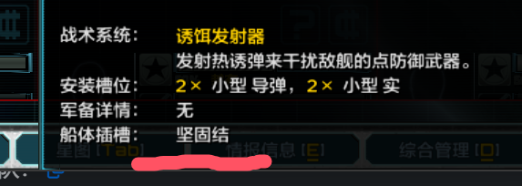
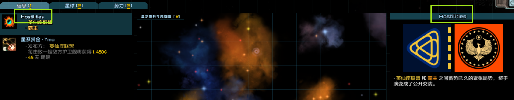
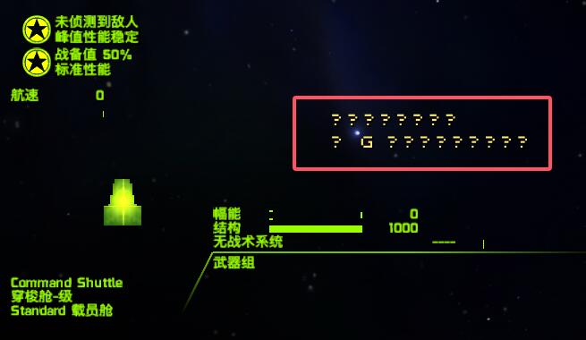
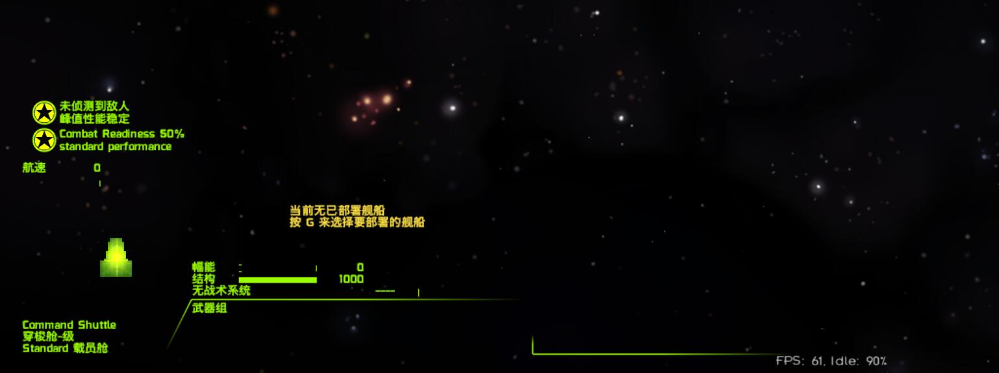
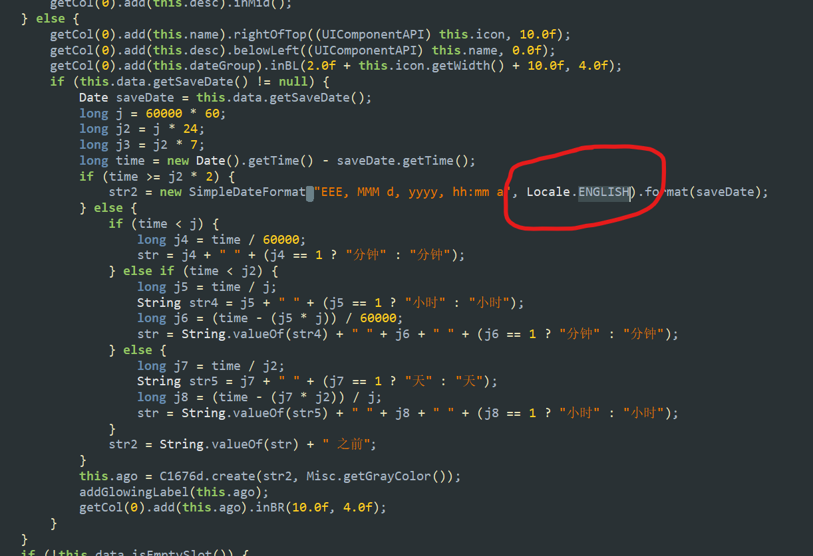

# 原文文件手动处理记录

本文件追踪当前版本中需要手动修改原文文件（`original/`）的内容。

> 以下所有 diff 方向均为：`game data/`（未修改的游戏原文件） → `original/`（已手动修改后的版本），
> 即 `-` 行为游戏原始内容，`+` 行为我们的修改结果。

---

# 一、Jar 文件

对于以下两种情况，我们需要手动编辑 jar 文件中的数据或代码：

1. 需要翻译的 string 对应的 UTF-8 常量同时被其它代码元素引用，无法直接替换。
2. 游戏本身的代码逻辑需要修改，以适应翻译后的文本。

## UTF-8常量被string以外的元素引用

| 文件路径 | 原文 | 修改为 | 备注 |
|---|---|---|---|
| starfarer_obf.jar:<br/>`com/fs/starfarer/campaign/CharacterStats.class` | `points` | `点` | 4处 |
| starfarer_obf.jar:<br/>`com/fs/starfarer/launcher/opengl/GLLauncher.class` | `fullscreen` | `全屏显示` | 用于读取配置项 key |
| starfarer_obf.jar:<br/>`com/fs/starfarer/launcher/opengl/GLLauncher.class` | `sound` | `启用声音` | 用于读取配置项 key |
| starfarer_obf.jar:<br/>`com/fs/starfarer/ui/newui/X.class` | `next` | `下一页` | |
| starfarer.api.jar:<br/>`com/fs/starfarer/api/impl/campaign/intel/group/FleetGroupIntel.class` | `fleets` | `舰队` | |
| starfarer.api.jar:<br/>`com/fs/starfarer/api/impl/campaign/intel/misc/TradeFleetDepartureIntel.class` | `goods` | `商品` | |
| starfarer.api.jar:<br/>`com/fs/starfarer/api/impl/campaign/intel/misc/TradeFleetDepartureIntel.class` | `materiel` | `物资` | |
| starfarer.api.jar:<br/>`com/fs/starfarer/api/impl/campaign/intel/misc/SalvorsTallyIntel.class` | `orbital` | `轨道` | 用于字符串 `.contains()` 判断 |
| starfarer.api.jar:<br/>`com/fs/starfarer/api/impl/campaign/CoreScript.class` | `ships`、`cargo`、`ships & cargo` | `泊位费`、`仓管费`、`泊位与仓管费` | 用于月度报告节点名称 |
| starfarer.api.jar:<br/>`com/fs/starfarer/api/impl/campaign/FactionPersonalityPickerPluginImpl.class` | `aggressive`、`reckless` | `激进`、`鲁莽` | |
| starfarer.api.jar:<br/>`com/fs/starfarer/api/impl/campaign/rulecmd/salvage/MarketCMD.class` | `objectives`（2处，分别在内部类 `$1`、`$2` 中） | `目标` | |
| starfarer.api.jar:<br/>`com/fs/starfarer/api/impl/campaign/rulecmd/salvage/MarketCMD.class` | `RaidDangerLevel` 枚举第二参数：`None`、`Minimal`、`Light`、`Moderate`、`Heavy`、`Extreme` | `无`、`极低`、`较低`、`普通`、`很高`、`极高` | 枚举显示名，硬编码在字节码中 |

> `starfarer.api.jar: com/fs/starfarer/api/impl/campaign/intel/FactionHostilityIntel.class` 中的 `Hostilities` 字符串（用于事件 tag）计划修改为 `敌对活动`，但 098 版本相关代码已变更，**尚未实施，待重新测试**。

### 复杂条目修改详情

**SalvorsTallyIntel.class** — `orbital` 用于 `.contains()` 判断，需保持英文：

```diff
- customEntitySpecAPI.getShortName().toLowerCase().contains("轨道")
+ customEntitySpecAPI.getShortName().toLowerCase().contains("orbital")
```

**CoreScript.class** — `ships`/`cargo`/`ships & cargo` 用作月度报告节点名称 key：

```diff
- string = f6 > 0.0f && f7 > 0.0f ? "泊位与仓管费" : (f6 > 0.0f ? "仓管费" : "泊位费");
+ string = f6 > 0.0f && f7 > 0.0f ? "ships & cargo" : (f6 > 0.0f ? "cargo" : "ships");
```

**MarketCMD.class** — `objectives` 在两个内部类中各出现一次，模式相同：

```diff
  Object object = "objective";
  if (arrayList.size() > 1) {
-     object = "目标";
+     object = "objectives";
  }
```

**MarketCMD.class** — `RaidDangerLevel` 枚举第二参数（显示名）：

```diff
- NONE("None", "无", ...),
- MINIMAL("Minimal", "极低", ...),
- LOW("Low", "较低", ...),
- MEDIUM("Medium", "普通", ...),
- HIGH("High", "很高", ...),
- EXTREME("Extreme", "极高", ...);
+ NONE("None", "None", ...),
+ MINIMAL("Minimal", "Minimal", ...),
+ LOW("Low", "Light", ...),
+ MEDIUM("Medium", "Moderate", ...),
+ HIGH("High", "Heavy", ...),
+ EXTREME("Extreme", "Extreme", ...);
```

---

## 代码逻辑修改

### 6. 舰船信息页文本末尾丢字




**原因**：游戏原代码在列举多个词条时，每项末尾追加 `", "`（英文逗号+空格，2字符），再统一截去末尾2字符。汉化将分隔符改为中文全角逗号 `"，"`（1字符），导致末尾多截了1个字符。

**修改方案**：将分隔符从 `"，"` 改回 `", "`，并将 `substring(0, length()-1)` 改为 `substring(0, length()-2)`。

**涉及文件**（均在 `starfarer_obf.jar`）：

**`S.class`、`StandardTooltipV2.class`、`FleetMemberRecoveryDialog.class`、`G.class`** — 各1处，模式相同：

```diff
- string = String.valueOf(string) + mod.getDisplayName() + "，";
+ string = String.valueOf(string) + mod.getDisplayName() + ", ";
  ...
- string = string.substring(0, string.length() - 1);
+ string = string.substring(0, string.length() - 2);
```

**`FleetMemberOrdnancePanel.class`** — 共3处，前两处为武器/插件列表，第三处含 `(D)`/`(S)` 标记：

```diff
// 武器/插件列表（前两处，变量名略有不同）
- object10 = hashMap.get(string5) + "×" + " " + string5 + "，";
+ object10 = hashMap.get(string5) + "×" + " " + string5 + ", ";
  if (...last element...) {
-     object10 = ((String)object10).substring(0, ((String)object10).length() - 1);
+     object10 = ((String)object10).substring(0, ((String)object10).length() - 2);
  }

// 改装列表（第三处，含 D-Mod/S-Mod 标记）
- object4 = mod.getDisplayName() + "，";
+ object4 = mod.getDisplayName() + ", ";
  if (bl8) {
-     object4 = mod.getDisplayName() + " (D)，";
+     object4 = mod.getDisplayName() + " (D), ";
  } else if (bl9) {
-     object4 = mod.getDisplayName() + " (S)，";
+     object4 = mod.getDisplayName() + " (S), ";
  }
  if (...last element...) {
-     object4 = ((String)object4).substring(0, ((String)object4).length() - 1);
+     object4 = ((String)object4).substring(0, ((String)object4).length() - 2);
  }
```

---

### 7. 敌对活动事件名称为英文 'Hostilities'

> **待处理**：098 相关代码已改变，需要重新测试。

相关文件：`starfarer.api.jar: com/fs/starfarer/api/impl/campaign/intel/FactionHostilityIntel.class`

代码中直接引用了事件 tag `Tags.INTEL_HOSTILITIES`，无法直接翻译。




**修改方案**：修改为直接返回字符串 `"敌对活动"`。

---

### 8. 战斗页面舰船部署提示字体不显示

相关文件：`starfarer_obf.jar: com/fs/starfarer/class/new/return.class`




**修改**：将字体从 `graphics/fonts/victor21.fnt` 改为 `graphics/fonts/victor14.fnt`。

```diff
- d d2 = new d(string, "graphics/fonts/victor21.fnt");
+ d d2 = new d(string, "graphics/fonts/victor14.fnt");
```

---

### 9. 战役界面左上角日期显示宽度不足

相关文件：`starfarer_obf.jar: com/fs/starfarer/campaign/ui/Oo0o.class`


**修改**：
1. 日期显示末尾加上 `"日"` 字。
2. 调整各显示元素宽度：年份/周期 60→100，月份 38→50，日期 35→50，整体组件 135→150。

```diff
- this.ø0Oo00 = new d(campaignClock.getDay() + ",", ...);
+ this.ø0Oo00 = new d(campaignClock.getDay() + "日,", ...);

- this.OOOo00.setSize(60.0f, ...);   // 年份/周期
- this.do.this$do.setSize(38.0f, ...); // 月份
- this.ø0Oo00.setSize(35.0f, ...);   // 日期
- this.setSize(135.0f, 28.0f);       // 整体
+ this.OOOo00.setSize(100.0f, ...);
+ this.do.this$do.setSize(50.0f, ...);
+ this.ø0Oo00.setSize(50.0f, ...);
+ this.setSize(150.0f, 28.0f);
```

---

### 10. 存档列表页存档保存日期未按中文格式化

相关文件：`starfarer_obf.jar: com/fs/starfarer/campaign/save/LoadGameDialog.class`（内部类 `$o`）



**修改**：将日期格式和 Locale 改为中文。

```diff
- SimpleDateFormat simpleDateFormat = new SimpleDateFormat("EEE, MMM d, yyyy, hh:mm a", Locale.ENGLISH);
+ SimpleDateFormat simpleDateFormat = new SimpleDateFormat("yyyy年M月d日 HH:mm:ss", Locale.CHINESE);
```

---

### 11. 星球列表页部分列宽度不足

相关文件：`starfarer_obf.jar: com/fs/starfarer/campaign/ui/intel/PlanetListV2.class`

**修改**：调整 SL（稳定点）和 Class（等级）列的宽度。

```diff
- this.øÓØ000.addColumn(..., "SL",    50.0f, ...);
- this.øÓØ000.addColumn(..., "Class", 65.0f, ...);
+ this.øÓØ000.addColumn(..., "SL",    75.0f, ...);
+ this.øÓØ000.addColumn(..., "Class", 60.0f, ...);
```

改动前后列宽对照：

| 列 | 改动前 | 改动后 |
|---|---|---|
| Name（名称） | 230+（浮动） | 230+（浮动） |
| Type（类型） | 270+（浮动） | 270+（浮动） |
| Location（位置） | 85 | 85 |
| Pop.（人口） | 60 | 60 |
| SL（稳定点） | 50 | 75 |
| Class（等级） | 65 | 60 |
| Hazard（危险度） | 75 | 75 |
| Dist（距离） | 60 | 60 |

---

# 二、settings.json

## cjkMode

**文件**：`localization/data/config/settings.json`

启用 CJK 字体的自动换行支持，中文显示必须开启。

```diff
- "cjkMode":false,
+ "cjkMode":true,
```

---

## showCNTranslationCredits

**文件**：`localization/data/config/settings.json`

显示汉化组制作人员名单。

```diff
- "showCNTranslationCredits":false,
+ "showCNTranslationCredits":true,
```

---

## designTypeColors 保留英文原文 key

**文件**：`original/data/config/settings.json`

**背景**：`designTypeColors` 对象以舰船设计类型名称为 key，游戏运行时通过 key 查找对应颜色。玩家加载未汉化的 mod 时，mod 中的舰船仍以英文设计类型名称注册，若 key 已被翻译为中文则无法匹配颜色。

**处理方式**：在 `localization/data/config/settings.json` 中，将 `designTypeColors` 的所有 key 翻译为中文后，在同一对象内手动追加一份完整的英文原文 key（value 相同），确保中英文两套名称均可命中颜色配置。

> 注意：此对象因此包含两倍数量的条目，中英文 key 均唯一，无真正重复。
