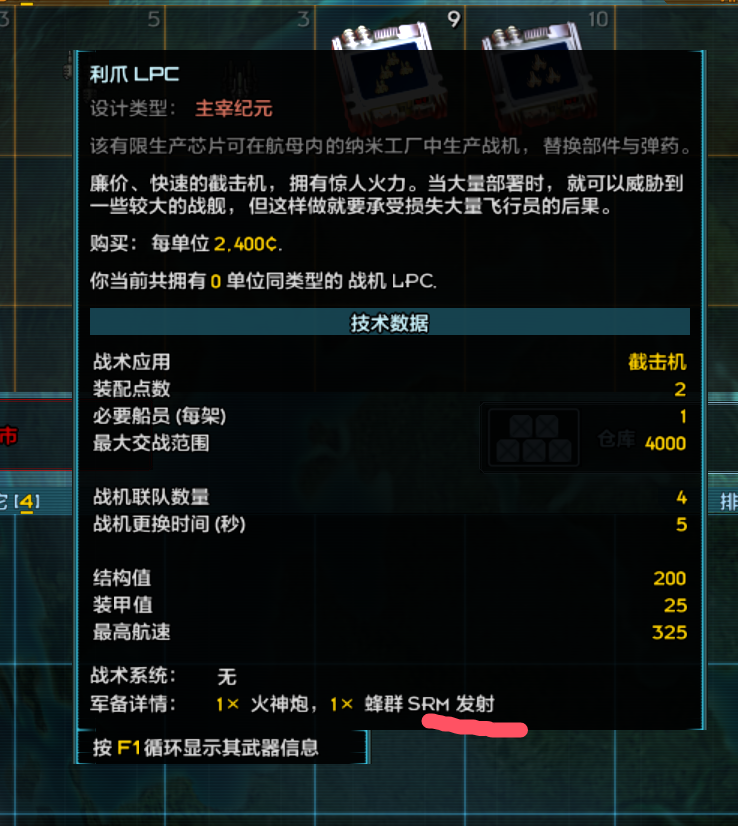
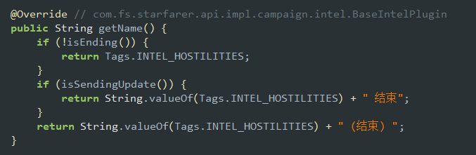

# Jar 预处理工具

本工具用于对《远行星号》游戏 jar 文件进行汉化前预处理，输出可供 ParaTranz 工作流直接使用的 jar 文件。

## 功能

预处理分两个阶段，按顺序对 `starfarer.api.jar` 和 `starfarer_obf.jar` 执行：

1. **ASM 字节码 Patch**：通过 [ASM](https://asm.ow2.io/) 库直接修改 `.class` 文件中的字节码，修复游戏原代码中与中文显示不兼容的逻辑（分隔符、字体、列宽、日期格式等）。各 Patch 的详细说明见下文。

2. **字符串解耦（jar-string-decoupler）**：调用 `vendor/jar-string-decoupler-1.0.0-all.jar`，将 `.class` 文件中硬编码的字符串常量提取并解耦，使 ParaTranz 的 jar 加载器能够读取、翻译并写回字符串，无需再手动修改字节码。该工具来自[jar-string-decoupler项目](https://github.com/jnxyp/jar-string-decoupler)。

处理完成后，结果 jar 同时写入仓库根目录的 `original/` 和 `localization/`，并在 `target/preprocess-work/preprocess-report.json` 生成处理报告（含输入/输出哈希、各 Patch 结果）。

## 环境要求

- **JDK 17+**（Maven Wrapper 已内置，无需单独安装 Maven）

## 使用方法

在 `jar_pre_processing/` 目录下执行：

```bash
# Windows
.\mvnw.cmd compile exec:java

# Linux / macOS
./mvnw compile exec:java
```

**前置条件**：仓库根目录的 `game data/` 下需存在待处理的原版 jar 文件：
- `game data/starfarer.api.jar`
- `game data/starfarer_obf.jar`

**输出**：
- `original/starfarer.api.jar`、`original/starfarer_obf.jar`
- `localization/starfarer.api.jar`、`localization/starfarer_obf.jar`
- `target/preprocess-work/preprocess-report.json`（处理报告）
- `target/preprocess-work/reports/*.decoupler.json`（解耦报告）

## 目录结构

```
jar_pre_processing/
├── src/main/java/.../preprocessing/
│   ├── JarPreProcessorMain.java   # 主入口
│   ├── JarWorkspace.java          # 路径管理与文件 IO
│   ├── JarRewriter.java           # ASM Patch 调度器
│   ├── DecouplerRunner.java       # jar-string-decoupler 调用
│   ├── PatchRegistry.java         # 注册所有 Patch
│   ├── JarPatch.java              # Patch 接口
│   └── patches/                   # 各具体 Patch 实现
├── vendor/
│   └── jar-string-decoupler-1.0.0-all.jar
├── docs/                          # 截图等文档资源
└── pom.xml
```

## 添加新 Patch

1. 在 `patches/` 目录下新建实现 `JarPatch` 接口的类。
2. 在 `PatchRegistry.patches()` 中注册该类。

---

# 修改记录

本节记录当前版本中各 ASM Patch 的修改背景与 diff，以及其他需要手动维护的配置文件改动。

> 以下所有 diff 方向均为：`game data/`（未修改的游戏原文件） → `original/`（已手动修改后的版本），
> 即 `-` 行为游戏原始内容，`+` 行为我们的修改结果。

游戏本身的代码逻辑需要修改，以适应翻译后的文本。

### 6. 舰船信息页文本末尾丢字

**对应 ASM Patch**：`src/main/java/org/fossic/starsector/preprocessing/patches/ShipInfoSeparatorPatch.java`




**原因**：游戏原代码在列举多个词条时，每项末尾追加 `", "`（英文逗号+空格，2字符），再统一截去末尾2字符。为了使用中文全角逗号作为分隔符，需要将分隔符改为 `"，"`（1字符），并同步调整去尾长度，否则会多截或少截字符。

**修改方案**：将分隔符从 `", "` 改为 `"，"`，并将 `substring(0, length()-2)` 改为 `substring(0, length()-1)`。

**涉及文件**（均在 `starfarer_obf.jar`）：

**`starfarer_obf.jar:com/fs/starfarer/campaign/ui/S.class`、`starfarer_obf.jar:com/fs/starfarer/ui/newui/FleetMemberRecoveryDialog.class`、`starfarer_obf.jar:com/fs/starfarer/ui/newui/G.class`** — 各1处，模式相同：

```diff
- string = String.valueOf(string) + mod.getDisplayName() + ", ";
+ string = String.valueOf(string) + mod.getDisplayName() + "，";
  ...
- string = string.substring(0, string.length() - 2);
+ string = string.substring(0, string.length() - 1);
```

**`starfarer_obf.jar:com/fs/starfarer/ui/impl/StandardTooltipV2.class`** — 当前 0.98 `game data/` 与 `original/` 中未发现上述目标模式，预处理脚本仅保留 guard 检查；若后续版本重新出现该模式，strict 模式应失败并要求补充 patch。

**`starfarer_obf.jar:com/fs/starfarer/ui/impl/FleetMemberOrdnancePanel.class`** — 共3处，前两处为武器/插件列表，第三处含 `(D)`/`(S)` 标记：

```diff
// 武器/插件列表（前两处，变量名略有不同）
- object10 = hashMap.get(string5) + "×" + " " + string5 + ", ";
+ object10 = hashMap.get(string5) + "×" + " " + string5 + "，";
  if (...last element...) {
-     object10 = ((String)object10).substring(0, ((String)object10).length() - 2);
+     object10 = ((String)object10).substring(0, ((String)object10).length() - 1);
  }

// 改装列表（第三处，含 D-Mod/S-Mod 标记）
- object4 = mod.getDisplayName() + ", ";
+ object4 = mod.getDisplayName() + "，";
  if (bl8) {
-     object4 = mod.getDisplayName() + " (D), ";
+     object4 = mod.getDisplayName() + " (D)，";
  } else if (bl9) {
-     object4 = mod.getDisplayName() + " (S), ";
+     object4 = mod.getDisplayName() + " (S)，";
  }
  if (...last element...) {
-     object4 = ((String)object4).substring(0, ((String)object4).length() - 2);
+     object4 = ((String)object4).substring(0, ((String)object4).length() - 1);
  }
```

---

### 7. 敌对活动事件名称为英文 'Hostilities'

**对应 ASM Patch**：`src/main/java/org/fossic/starsector/preprocessing/patches/FactionHostilityNoManualPatch.java`

> **0.98 中不再适用**：当前 `original/starfarer.api.jar` 中仍保留 `Hostilities`，但 ParaTranz 导出数据中已有 `"Hostilities" -> "敌对活动"` 译文。后续预处理应依赖 `jar-string-decoupler` 解耦后由 ParaTranz 写回，不再作为 ASM 或手动替换项处理。

相关文件：`starfarer.api.jar: com/fs/starfarer/api/impl/campaign/intel/FactionHostilityIntel.class`

旧版本中代码直接引用了事件 tag `Tags.INTEL_HOSTILITIES`，曾计划通过手动修改返回值处理。




**当前处理方式**：不再手动修改此 class，保留原文字符串并交由 ParaTranz 流程写入译文。

---

### 8. 战斗页面舰船部署提示字体不显示

**对应 ASM Patch**：`src/main/java/org/fossic/starsector/preprocessing/patches/CombatDeploymentFontPatch.java`

相关文件：`starfarer_obf.jar: com/fs/starfarer/class/new/return.class`


**修改**：将字体从 `graphics/fonts/victor21.fnt` 改为 `graphics/fonts/victor16.fnt`。该类共有 2 处此字符串引用，均被替换。

```diff
- d d2 = new d(string, "graphics/fonts/victor21.fnt");
+ d d2 = new d(string, "graphics/fonts/victor16.fnt");
```

---

### 9. 战役界面左上角日期显示宽度不足

**对应 ASM Patch**：`src/main/java/org/fossic/starsector/preprocessing/patches/CampaignDateWidthPatch.java`

相关文件：`starfarer_obf.jar: com/fs/starfarer/campaign/ui/Oo0o.class`


**修改**：
1. 日期显示末尾加上 `"日"` 字。
2. 调整各显示元素宽度：年份/周期 60→100，月份 38→50，日期 35→50，整体组件 135→150。

```diff
- this.ø0Oo00 = new d(campaignClock.getDay() + ",", ...);
+ this.ø0Oo00 = new d(campaignClock.getDay() + "日,", ...);

- this.OOOo00.setSize(60.0f, ...);   // 年份/周期
- this.do.this$do.setSize(38.0f, ...); // 月份
- this.ø0Oo00.setSize(35.0f, ...);   // 日期
- this.setSize(135.0f, 28.0f);       // 整体
+ this.OOOo00.setSize(100.0f, ...);
+ this.do.this$do.setSize(50.0f, ...);
+ this.ø0Oo00.setSize(50.0f, ...);
+ this.setSize(150.0f, 28.0f);
```

---

### 10. 存档列表页存档保存日期未按中文格式化

**对应 ASM Patch**：`src/main/java/org/fossic/starsector/preprocessing/patches/SaveDateLocalePatch.java`

相关文件：`starfarer_obf.jar: com/fs/starfarer/campaign/save/LoadGameDialog$o.class`


**修改**：将日期格式和 Locale 改为中文。

```diff
- SimpleDateFormat simpleDateFormat = new SimpleDateFormat("EEE, MMM d, yyyy, hh:mm a", Locale.ENGLISH);
+ SimpleDateFormat simpleDateFormat = new SimpleDateFormat("yyyy年M月d日 HH:mm:ss", Locale.CHINESE);
```

---

### 11. 星球列表页部分列宽度不足

**对应 ASM Patch**：`src/main/java/org/fossic/starsector/preprocessing/patches/PlanetListColumnWidthPatch.java`

相关文件：`starfarer_obf.jar: com/fs/starfarer/campaign/ui/intel/PlanetListV2.class`

**修改**：调整 SL（稳定点）和 Class（等级）列的宽度。

```diff
- this.øÓØ000.addColumn(..., "SL",    50.0f, ...);
- this.øÓØ000.addColumn(..., "Class", 65.0f, ...);
+ this.øÓØ000.addColumn(..., "SL",    75.0f, ...);
+ this.øÓØ000.addColumn(..., "Class", 60.0f, ...);
```

改动前后列宽对照：

| 列 | 改动前 | 改动后 |
|---|---|---|
| Name（名称） | 230+（浮动） | 230+（浮动） |
| Type（类型） | 270+（浮动） | 270+（浮动） |
| Location（位置） | 85 | 85 |
| Pop.（人口） | 60 | 60 |
| SL（稳定点） | 50 | 75 |
| Class（等级） | 65 | 60 |
| Hazard（危险度） | 75 | 75 |
| Dist（距离） | 60 | 60 |

---

### 12. 星系地图星系名称字体偏小

**对应 ASM Patch**：
- `src/main/java/org/fossic/starsector/preprocessing/patches/StarSystemMapFontPatch.java`

**背景**：星系地图的星系名称 label 在缩放时会在两档字体间切换：

- 缩放值 > 阈值 → 小字（原为 `graphics/fonts/victor10.fnt`）
- 缩放值 ≤ 阈值 → 大字（原为 `graphics/fonts/victor14.fnt`）

切换逻辑位于通用地图标记父类 `starfarer_obf.jar: com/fs/starfarer/coreui/A/ooOO.class`。

汉字在原始小字体下可读性较差，因此将两档字体整体上调一级。

**修改：两档字体整体上调**

涉及文件：`starfarer_obf.jar: com/fs/starfarer/coreui/A/ooOO.class`

Patch 先替换大字体 `victor14.fnt` → `victor16.fnt`，再替换小字体 `victor10.fnt` → `victor14.fnt`，避免新写入的小字体 `victor14.fnt` 被二次替换。

```diff
- object = f5 > this.ö00000() ? "graphics/fonts/victor10.fnt" : "graphics/fonts/victor14.fnt";
+ object = f5 > this.ö00000() ? "graphics/fonts/victor14.fnt" : "graphics/fonts/victor16.fnt";
```
